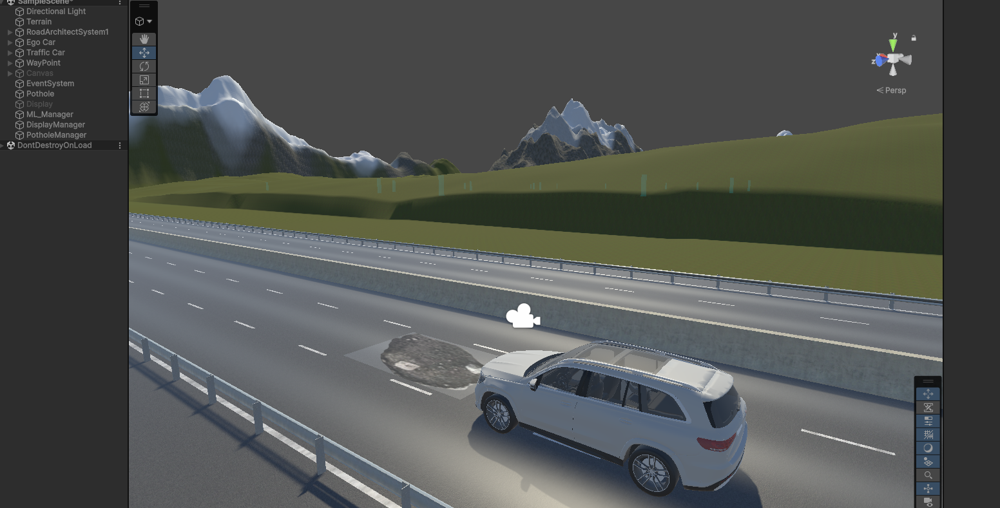
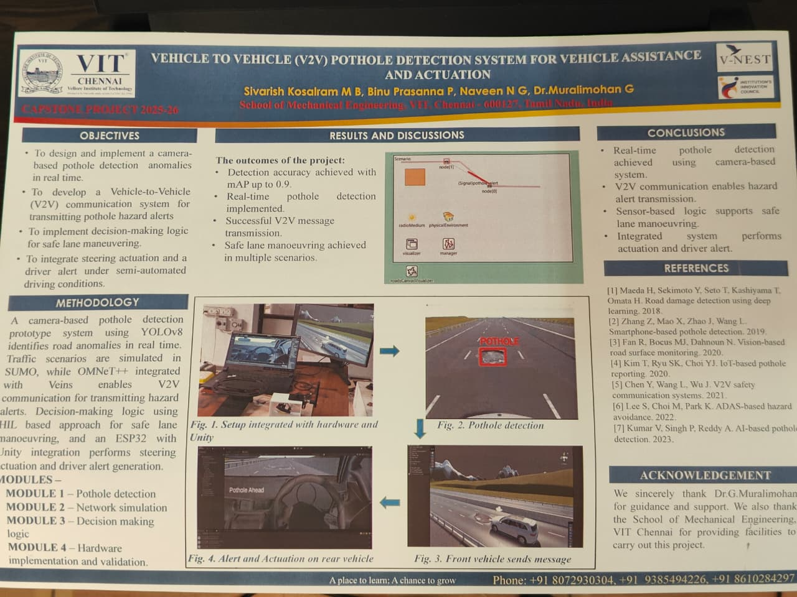
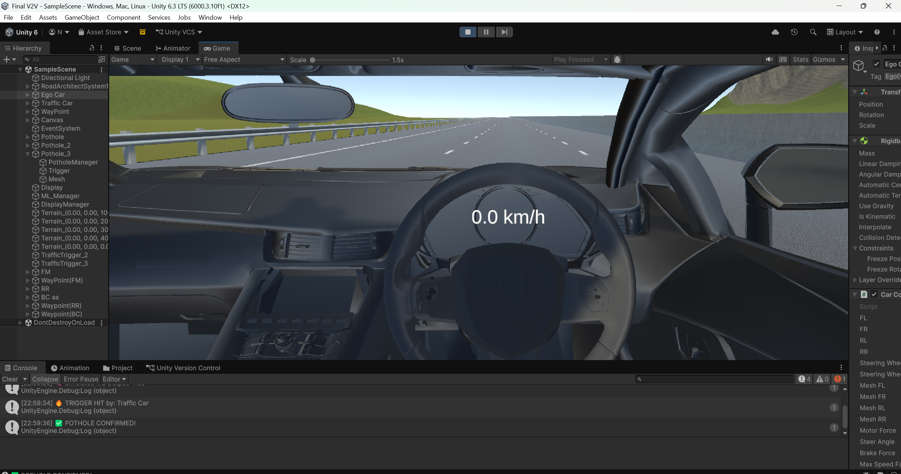
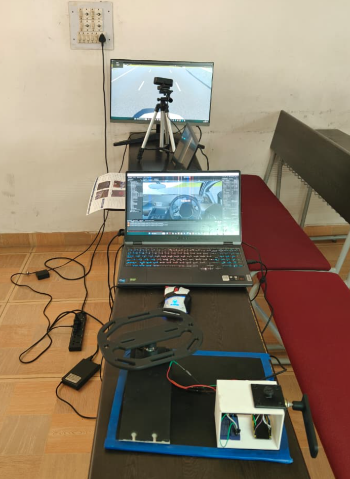

# V2V-Based Pothole Detection & ADAS Evasion System

## Overview
This project simulates a complete Vehicle-to-Vehicle (V2V) safety ecosystem designed to detect, share, and evade road hazards (potholes) in real time. It combines Machine Learning (YOLO) for environmental perception, cloud infrastructure for V2V communication, Unity for 3D simulation, and a custom hardware steering setup for physical driver feedback and manual control.

## System Workflow & Architecture
The system operates in a multi-stage detection and evasion loop:

### Phase 1: Detection & Data Sharing (Traffic Vehicle)
1. A traffic vehicle, equipped with a forward-facing ADAS camera, drives along the simulated road.  
2. A custom-trained YOLO model processes the camera feed to identify potholes in real time.  
3. Upon detection, the exact coordinates of the pothole are uploaded instantly to the cloud.  

### Phase 2: Alert & Haptic Feedback (Ego Vehicle)
4. The ego vehicle (controlled manually via a custom steering hardware setup) approaches the hazard zone and continuously syncs with the cloud.  
5. As the vehicle nears the pothole's coordinates, an initial warning is displayed on the digital cluster.  
6. A haptic motor in the steering wheel generates vibration feedback to alert the driver.  

### Phase 3: ADAS Intervention
7. If the driver ignores the warning (fails to reduce speed or change lanes), the ADAS module takes control.  
8. **Evasive Steering Assist:** The system calculates a safe trajectory, and the steering wheel automatically rotates to execute a lane change.  
9. **Partial AEB:** If the adjacent lane is occupied, the system aborts lane change and applies partial braking.  

## Technologies & Hardware

### Software Stack
- Unity 3D  
- Python  
- YOLO (Ultralytics)  
- OpenCV  
- C# (Unity scripting)  

### Custom Hardware Setup
- Steering wheel controller for manual ego vehicle control  
- Haptic feedback motor for driver alerts  
- Auto-steering actuation for ADAS intervention  

## Project Output

### Pothole

### Poster

### Ego Car View

### Hardware Setup

## Project Demonstration

### ML Pothole Detection
[ML Detection](https://www.youtube.com/watch?v=AAuDOnvl6F8)

### Unity Simulation & ADAS
[Unity Simulation](https://www.youtube.com/watch?v=4p8_QqHc1oI)

### Hardware Demo
[Hardware Demo](https://www.youtube.com/watch?v=6yJmZe7CJ7w)

## Getting Started (ML Detection Module)

While the full Unity simulation is excluded due to size constraints (~5GB), the YOLO-based detection module can be run locally.

## Skills Demonstrated

- Computer Vision: Real-time pothole detection using YOLO and OpenCV  
- Machine Learning: Model training, inference, and detection pipeline integration  
- ADAS Logic Development: Designed decision-making system for warning, lane change assist, and partial AEB  
- Simulation: Built interactive 3D environment using Unity for real-time testing  
- Embedded Systems: Developed steering wheel hardware with haptic feedback and actuation  
- System Integration: Integrated ML model, cloud communication, simulation, and hardware  
- Problem Solving: Designed multi-stage safety workflow for real-world driving scenarios  

## Key Learning Outcomes

- Understanding of ADAS systems and real-time vehicle safety logic  
- Hands-on experience in integrating ML models with simulation environments  
- Knowledge of V2V communication concepts and cloud-based data sharing  
- Experience in hardware-software co-design (control + feedback systems)  

## Note

Due to GitHub file size limitations, the full Unity project (~5GB) is not included.
This repository focuses on the ML model, system design, and simulation results.

## Future Scope
-Integration with vehicle CAN/LIN systems
-GPS-based hazard mapping
-Multi-vehicle V2V communication

Author
Naveen N G
